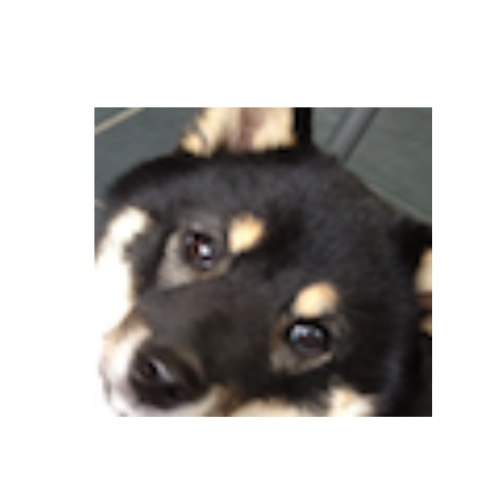
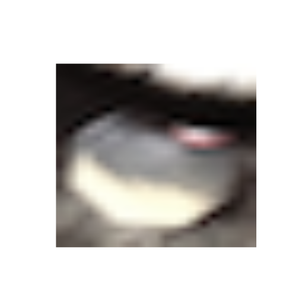
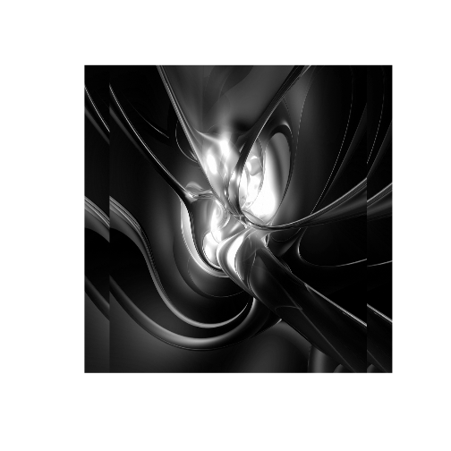
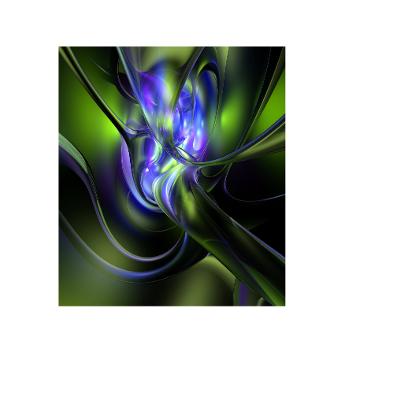
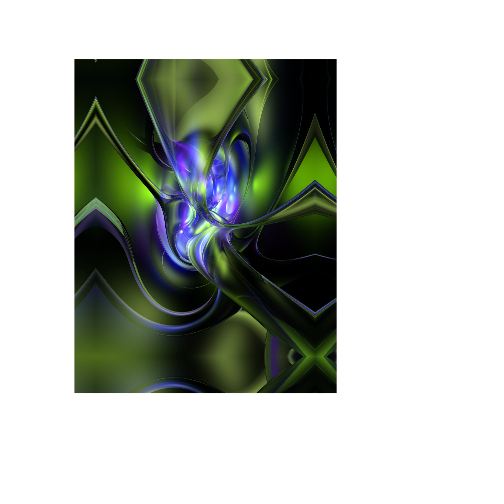
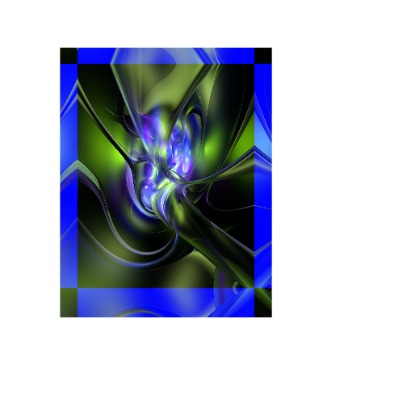

```r
require(jpeg)
```

```
## Loading required package: jpeg
```

```r
require(png)
```

```
## Loading required package: png
```

```r
require(COMP121)
```

```
## Loading required package: COMP121 Loading required package: RCurl Loading
## required package: bitops Loading required package: markdown
```

```r
puppy <- readPNG(getURLContent("http://dtkaplan.github.io/ScientificComputing/Resources/Images/mindo.png"))
canvas(x = c(1, 220), y = c(1, 220), asp = 1)
rasterImage(puppy, 1, 1, 216, 198)
```

 

```r
# Cropping Tasks
canvas(x = c(1, 220), y = c(1, 220), asp = 1)
rasterImage(puppy[20:100, 100:180, ], 1, 1, 216, 198)
```

 

```r
canvas(x = c(1, 220), y = c(1, 220), asp = 1)
rasterImage(puppy[140:198, 1:40, ], 1, 1, 216, 198)
```

 

```r
canvas(x = c(1, 220), y = c(1, 220), asp = 1)
rasterImage(puppy[115:140, 100:120, ], 1, 1, 216, 198)
```

 

```r
canvas(x = c(1, 1000), y = c(1, 1000))

new <- readJPEG(getURLContent("http://wholles.com/wp-content/uploads/2013/08/Cool-Wallpaper-HD.jpg"))
dim(new)
```

```
## [1]  768 1024    3
```

```r
rasterImage(new, 1, 1, 1000, 1000)
```

 

```r
canvas(x = c(1, 1200), y = c(1, 1200), asp = 1)
new2 <- new[, , 1]
new3 <- cbind(new2[, 1:100], new2, new2[, 900:1000])
rasterImage(new3, 1, 1, 1200, 1200)
```

 

```r

framer <- function(picture, width) {
    picture2 <- picture[, , 1]
    r <- dim(picture2)[1]
    col <- dim(picture2)[2]
    canvas(x = c(1, col + width), y = c(1, r + width), asp = 1)
    picture3 <- cbind(picture2[, rev(1:width)], picture2, picture2[, rev((col - 
        width):col)])
    picture4 <- rbind(picture3[rev(1:width), ], picture3, picture3[rev((r - 
        width):r), ])
    rasterImage(picture4, 1, 1, r, col)
}

framer(new, 100)
```

 

```r


framer2 <- function(picture, width) {
    red <- picture[, , 1]
    green <- picture[, , 2]
    blue <- picture[, , 3]
    r <- dim(picture)[1]
    col <- dim(picture)[2]
    canvas(x = c(1, col + width), y = c(1, r + width), asp = 1)
    picture3 <- cbind(red[, rev(1:width)], red, red[, rev((col - width):col)])
    picture4 <- rbind(picture3[rev(1:width), ], picture3, picture3[rev((r - 
        width):r), ])
    picture5 <- cbind(green[, rev(1:width)], green, green[, rev((col - width):col)])
    picture6 <- rbind(picture5[rev(1:width), ], picture5, picture5[rev((r - 
        width):r), ])
    picture7 <- cbind(blue[, rev(1:width)], blue, blue[, rev((col - width):col)])
    picture8 <- rbind(picture7[rev(1:width), ], picture7, picture7[rev((r - 
        width):r), ])
    bannanas <- array(c(picture6, picture8, picture4), dim = c(dim(picture6), 
        3))
    
    rasterImage(bannanas, 1, 1, r, col)
}


framer2(new, 0)
```

 

```r
framer2(new, 100)
```

 


```r
framer3 <- function(picture, width, negative = FALSE) {
    red <- picture[, , 1]
    green <- picture[, , 2]
    blue <- picture[, , 3]
    r <- dim(picture)[1]
    col <- dim(picture)[2]
    # take the negative image when appropriate
    f <- function(x) {
        if (negative) 
            (1 - x) else return(x)
    }
    canvas(x = c(1, col + width), y = c(1, r + width), asp = 1)
    picture3 <- cbind(f(red[, rev(1:width)]), red, f(red[, rev((col - width):col)]))
    picture4 <- rbind(f(picture3[rev(1:width), ]), picture3, f(picture3[rev((r - 
        width):r), ]))
    picture5 <- cbind(green[, rev(1:width)], green, green[, rev((col - width):col)])
    picture6 <- rbind(picture5[rev(1:width), ], picture5, picture5[rev((r - 
        width):r), ])
    picture7 <- cbind(blue[, rev(1:width)], blue, blue[, rev((col - width):col)])
    picture8 <- rbind(picture7[rev(1:width), ], picture7, picture7[rev((r - 
        width):r), ])
    bannanas <- array(c(picture6, picture8, picture4), dim = c(dim(picture6), 
        3))
    
    rasterImage(bannanas, 1, 1, r, col)
}
framer3(new, 100, negative = TRUE)
```

 


framerC<-function(picture,width,Green=TRUE,Blue=TRUE,Red=TRUE){
  red<-picture[,,1]
  green<-picture[,,2]
  blue<-picture[,,3]
  r<-dim(picture)[1]
  col<-dim(picture)[2]
  canvas(x=c(1,col+width),y=c(1,r+width),asp=1)
  ifelse(Red==TRUE,picture3<-cbind(red[,rev(1:width)],red,red[,rev((col-width):col)])
  picture4<-rbind(picture3[rev(1:width),],picture3,picture3[rev((r-width):r),]),NA)
  ifelse(Green==TRUE,picture5<-cbind(green[,rev(1:width)],green,green[,rev((col-width):col)])
  picture6<-rbind(picture5[rev(1:width),],picture5,picture5[rev((r-width):r),]),NA)
  ifelse(Blue==TRUE,picture7<-cbind(blue[,rev(1:width)],blue,blue[,rev((col-width):col)])
  picture8<-rbind(picture7[rev(1:width),],picture7,picture7[rev((r-width):r),]),NA)
  bannanas<-array(c(picture6,picture8,picture4),dim=c(dim(picture6),3))

  rasterImage(bannanas,1,1,r,col)
}

framerC(new,100,Green=FALSE,Blue=TRUE,Red=TRUE)


```
